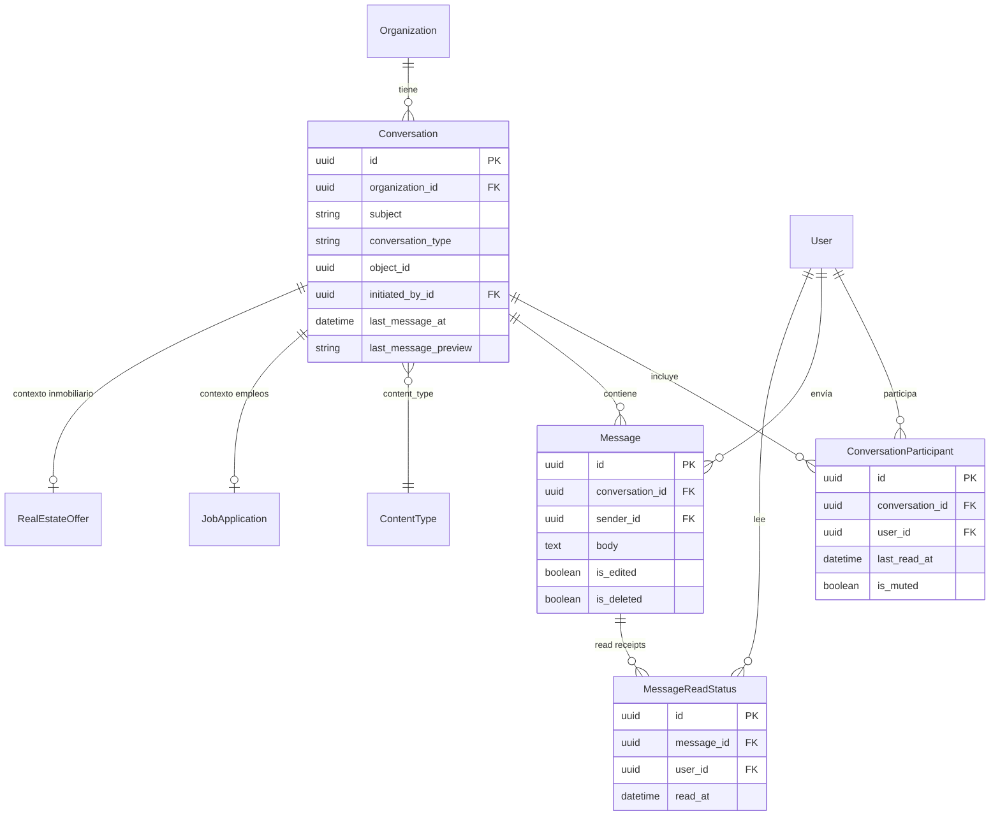
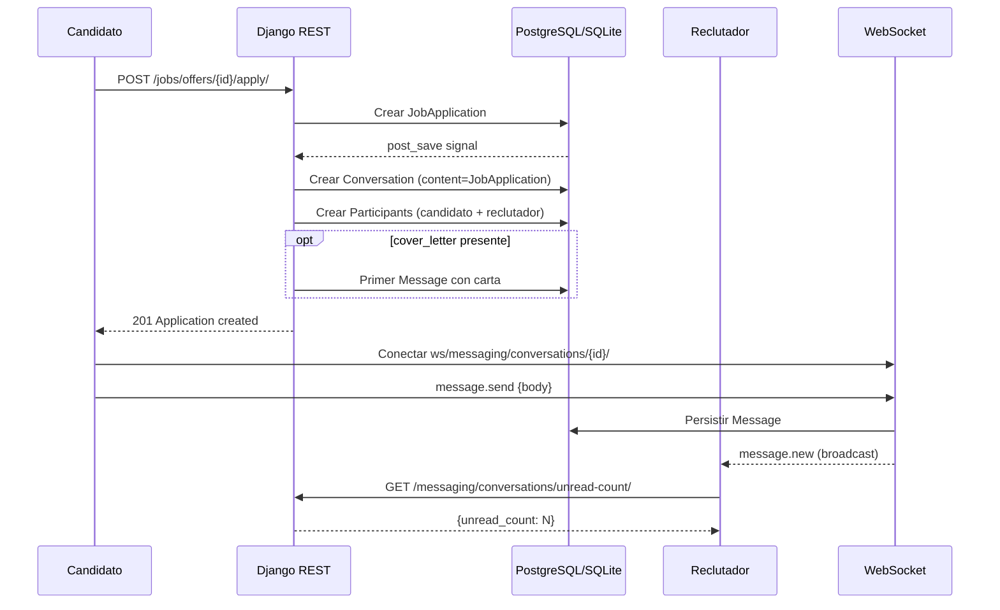
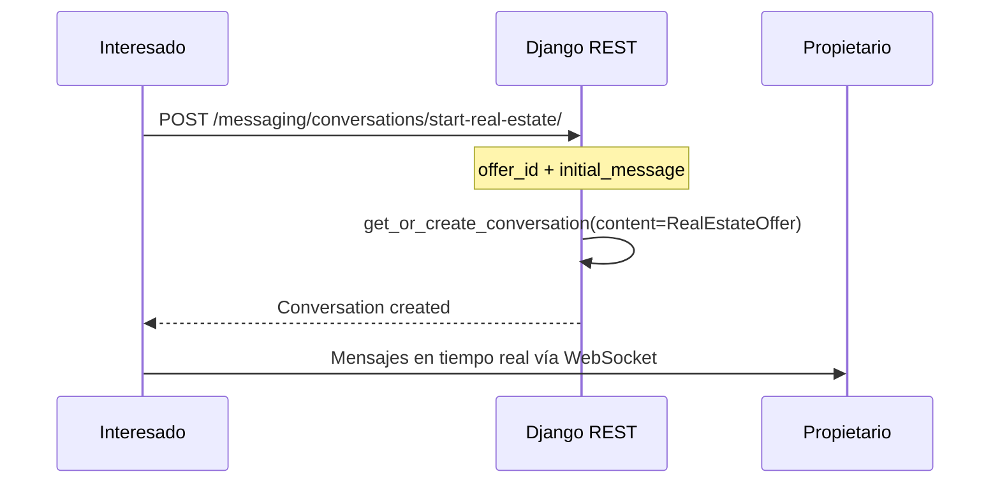

# Sistema de Mensajería en Tiempo Real — Arquitectura

Documentación del módulo de chat reutilizable para empleos, bienes raíces y futuros módulos.

---

## 1. Visión General

El sistema permite conversaciones privadas entre usuarios vinculadas a un **objeto de contexto** (postulación laboral, propiedad inmobiliaria, etc.) mediante una arquitectura **polimórfica** con `ContentTypes` y `GenericForeignKey`.

### Principios de diseño

| Principio | Implementación |
|-----------|----------------|
| Reutilización | Una sola app `messaging` sirve a todos los módulos |
| Polimorfismo | `GenericForeignKey` vincula conversaciones a cualquier modelo |
| Multi-tenant | Todas las conversaciones tienen FK a `Organization` |
| Seguridad | Solo participantes acceden; JWT en REST y WebSocket |
| Escalabilidad | Índices DB, paginación, Redis channel layer en producción |

---

## 2. Diagrama de Modelos



---

## 3. Flujo de Datos

### Caso 1: Empleos (automático)



### Caso 2: Bienes Raíces (manual)



---

## 4. Estructura de Carpetas

### Backend (`tenant/messaging/`)

```
messaging/
├── models.py           # Conversation, Participant, Message, ReadStatus
├── services.py         # Lógica de negocio reutilizable
├── signals.py          # Auto-crear chat al postularse
├── serializers.py      # DRF serializers
├── views.py            # ViewSets REST
├── permissions.py      # IsConversationParticipant, IsMessageSender
├── consumers.py        # WebSocket ChatConsumer
├── middleware.py       # JWT auth para WebSocket
├── routing.py          # Rutas WS
├── urls.py             # Rutas REST
├── admin.py
└── migrations/
```

### Frontend (`src/`)

```
src/
├── types/chat.ts
├── lib/chatApi.ts
├── hooks/
│   ├── useChat.ts
│   └── useChatSocket.ts
├── components/Chat/
│   ├── ChatList.tsx
│   ├── ChatWindow.tsx
│   ├── MessageBubble.tsx
│   ├── ChatHeader.tsx
│   ├── ChatComposer.tsx
│   ├── ChatEmptyState.tsx
│   ├── UnreadBadge.tsx
│   └── ApplicationChatButton.tsx
└── pages/Messages/
    └── MessagesPage.tsx
```

---

## 5. API REST

| Método | Endpoint | Descripción |
|--------|----------|-------------|
| GET | `/api/v1/messaging/conversations/` | Listar conversaciones del usuario |
| POST | `/api/v1/messaging/conversations/` | Crear conversación genérica |
| GET | `/api/v1/messaging/conversations/{id}/` | Detalle de conversación |
| GET | `/api/v1/messaging/conversations/{id}/messages/` | Mensajes paginados |
| POST | `/api/v1/messaging/conversations/{id}/send/` | Enviar mensaje (REST fallback) |
| POST | `/api/v1/messaging/conversations/{id}/mark_read/` | Marcar como leído |
| GET | `/api/v1/messaging/conversations/unread-count/` | Total no leídos |
| GET | `/api/v1/messaging/conversations/by-application/{id}/` | Chat por postulación |
| POST | `/api/v1/messaging/conversations/start-real-estate/` | Iniciar chat inmobiliario |
| PATCH | `/api/v1/messaging/messages/{id}/` | Editar mensaje propio |
| DELETE | `/api/v1/messaging/messages/{id}/` | Eliminar mensaje (soft delete) |

### WebSocket

```
ws://host/ws/messaging/conversations/{conversation_id}/?token={jwt_access_token}
```

**Eventos cliente → servidor:**
- `message.send` — `{ type, body }`
- `typing.start` / `typing.stop`
- `read.mark`

**Eventos servidor → cliente:**
- `message.new` — nuevo mensaje
- `typing` — indicador escribiendo
- `read.update` — lectura confirmada
- `presence` — online/offline (opcional)

---

## 6. Configuración

### Desarrollo (sin Redis)

```python
# config/settings/development.py
CHANNEL_LAYERS = {
    "default": {
        "BACKEND": "channels.layers.InMemoryChannelLayer",
    },
}
```

```bash
cd tenant
python manage.py runserver --settings=config.settings.development
# Para WebSocket en dev, usar daphne:
daphne -b 0.0.0.0 -p 8000 config.asgi:application
```

### Producción (Redis)

```python
# config/settings/base.py
CHANNEL_LAYERS = {
    "default": {
        "BACKEND": "channels_redis.core.RedisChannelLayer",
        "CONFIG": {"hosts": [os.getenv("REDIS_URL")]},
    },
}
```

```bash
# .env
REDIS_URL=redis://127.0.0.1:6379/1
```

Servir con **Daphne** o **Uvicorn** detrás de Nginx con proxy WebSocket:

```nginx
location /ws/ {
    proxy_pass http://daphne;
    proxy_http_version 1.1;
    proxy_set_header Upgrade $http_upgrade;
    proxy_set_header Connection "upgrade";
}
```

---

## 7. Seguridad

1. **REST**: JWT + `IsOrganizationMember` + `IsConversationParticipant`
2. **WebSocket**: JWT en query string validado por `JWTAuthMiddleware`
3. **Mensajes**: Sanitización XSS con `bleach` (sin HTML permitido)
4. **Soft delete**: Mensajes eliminados no se muestran pero se conservan para auditoría
5. **Unicidad**: Una conversación por `(content_type, object_id, initiated_by)` evita duplicados

---

## 8. Plan de Implementación (completado)

| Fase | Estado | Descripción |
|------|--------|-------------|
| 1 | ✅ | Modelos + migraciones |
| 2 | ✅ | Servicios + signals (auto-chat empleos) |
| 3 | ✅ | API REST + permisos |
| 4 | ✅ | Django Channels + WebSocket |
| 5 | ✅ | Componentes React reutilizables |
| 6 | ✅ | Integración empleos (MyApplications, ReceivedApplications) |
| 7 | 🔜 | Módulo bienes raíces frontend + botón "Contactar propietario" |
| 8 | 🔜 | Notificaciones push / email digest |
| 9 | 🔜 | Adjuntos de archivos en mensajes |

---

## 9. Extender a Nuevos Módulos

Para agregar chat a un nuevo módulo (ej. eventos):

```python
# 1. En el servicio del módulo o en messaging/services.py
def create_event_conversation(*, event, interested_user):
    return get_or_create_conversation(
        organization=event.organization,
        participants=[interested_user, event.organizer],
        content_object=event,
        conversation_type="event",  # agregar a ConversationType
        subject=f"Consulta: {event.title}",
        initiated_by=interested_user,
    )

# 2. Agregar contexto en serializers._build_context()
# 3. En frontend: botón que llame al endpoint correspondiente
```

---

## 10. Buenas Prácticas para Producción

- Usar **PostgreSQL** en lugar de SQLite
- **Redis** obligatorio para channel layer multi-instancia
- Índices en `(conversation_id, created_at)` ya definidos
- Paginar mensajes (20 por página, scroll infinito hacia arriba)
- Rate limiting en envío de mensajes (throttle DRF)
- Monitoreo de conexiones WebSocket activas
- Backup de mensajes con retención policy
- Considerar **Celery** para notificaciones email/push asíncronas
